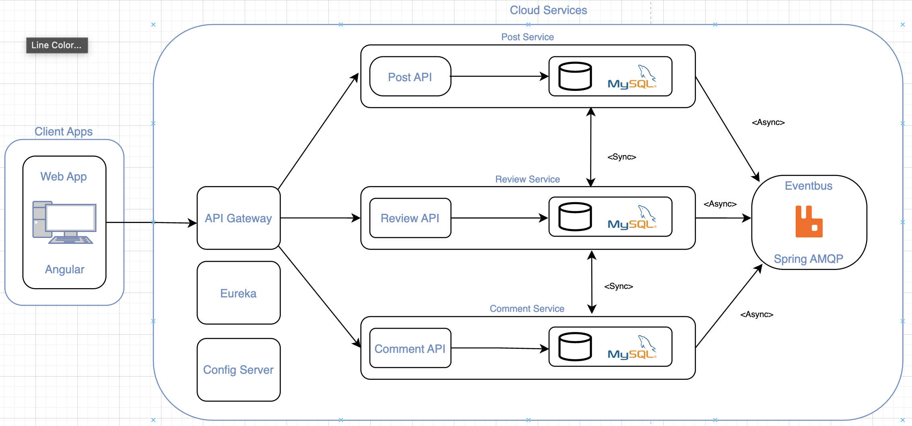

# Architecture

## Diagram

## Synchronous Communication
- **Fetching Reviews** (US1, US4): When retrieving a post along with its reviews, the `PostService` synchronously calls the `ReviewService` to fetch reviews by post ID.  

- **Fetching Comments** (US4, US10, US11): To get a post with its associated comments, the `PostService` makes a synchronous request to the `CommentService`.  

- **Post Approval Status**(US7, US8, US9): When a post is approved or rejected via the `ReviewService`, it directly updates the post status in the `PostService`.  

- **Review Eligibility Check** (US2, US7): Before reviewing a post, the `ReviewService` checks if the post is in a "submitted" state by calling the `PostService`.  

## Asynchronous Communication
- **Post Approval Notification** (US7, US8): After a post is approved or rejected in the `ReviewService`, an event is sent to the queue using RabbitMQ. The `PostService` asynchronously listens to this queue to update the status of the post accordingly.  

- **Comment Notifications** (US10, US11, US12): When a new comment is added in the `CommentService`, an event is emitted to notify other services asynchronously, ensuring updates without blocking the main flow.  

## User Stories

### PostService
- **US1**: As an editor, I want to be able to create new posts so that I can share news and updates with the organization.
- **US2**: As an editor, I want to save posts as drafts so that I can continue working on them later or wait for approval.
- **US3**: As an editor, I want to edit the content of a post so that I can correct errors and update information.
- **US4**: As a user, I want to see an overview of published posts so that I can stay informed about the latest news.
- **US5**: As a user, I want to filter posts based on content, author, and category.

### ReviewService
- **US7**: As a chief editor, I want to review submitted posts and either approve or reject them so that only approved content is published.
- **US8**: As an editor, I want to receive a notification when a post is approved or rejected so that I know whether it can be published or needs revision.
- **US9**: As an editor, I want to add comments when rejecting a post so that the author knows what changes are needed.

### CommentService
- **US10**: As a user, I want to be able to add a comment to a post so that I can share my opinion or ask questions.
- **US11**: As a user, I want to read comments from other colleagues so that I can understand their opinions or questions about the article.
- **US12**: As a user, I want to edit or delete my own comments so that I can always correct or remove my contributions.